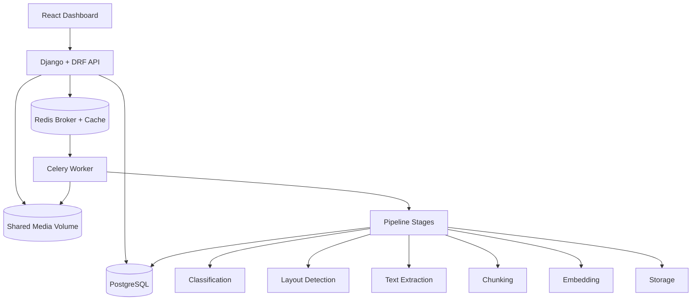

# Async Document Processing Platform

Asynchronous document ingestion and processing system for PDF/DOCX files with JWT auth, Celery workers, Redis queue/cache, PostgreSQL metadata, searchable chunks, and Dockerized deployment.

## Quickstart

1. Copy environment config:
```bash
cp .env.example .env
```

2. Start services:
```bash
docker compose up --build
```

3. Open services:
- API: `http://localhost:8000`
- Swagger: `http://localhost:8000/api/docs/`
- Metrics: `http://localhost:8000/metrics`
- Frontend dashboard: `http://localhost:3000`

4. Create user and token from Swagger or API examples below.

5. Upload a document and track task status.

## Architecture Diagram



## End-to-End Workflow

1. Client uploads PDF/DOCX (or ZIP batch).
2. API validates file type, MIME, signature, and safety limits.
3. API writes file metadata and enqueues Celery job.
4. Worker executes staged pipeline:
   - classification
   - layout detection
   - text extraction
   - chunking
   - embedding/indexing (parallelized)
   - storage
5. `Document` and `ProcessingTask` are updated.
6. Processed content is searchable through `/api/search/documents/`.
7. Metrics and structured logs are emitted for observability.

## Pipeline Modules

```text
backend/pipeline/
  ingestion.py
  parsing.py
  chunking.py
  metadata.py
  indexing.py
```

## API Examples

### 1) Register
```bash
curl -X POST http://localhost:8000/api/auth/register/ \
  -H "Content-Type: application/json" \
  -d '{"username":"alice","email":"alice@example.com","password":"StrongPass123"}'
```

### 2) Login (JWT)
```bash
curl -X POST http://localhost:8000/api/auth/token/ \
  -H "Content-Type: application/json" \
  -d '{"username":"alice","password":"StrongPass123"}'
```

Sample response:
```json
{
  "refresh": "<refresh-token>",
  "access": "<access-token>"
}
```

### 3) Upload document
```bash
curl -X POST http://localhost:8000/api/documents/upload/ \
  -H "Authorization: Bearer <access-token>" \
  -F "file=@/path/to/file.pdf"
```

Sample response (`202 Accepted`):
```json
{
  "id": "0dc2f690-a0ec-4ec3-80e6-42fb35a03ad0",
  "original_filename": "file.pdf",
  "status": "PROCESSING",
  "processing_task": {
    "id": "87d31627-9c4d-4dc2-a667-50f60b8e1adc",
    "status": "PENDING",
    "celery_task_id": "0d2b6bf3-6342-49c1-b4e7-4da4eeb2f500",
    "error_message": ""
  },
  "chunk_count": 0
}
```

### 4) Batch upload ZIP
```bash
curl -X POST http://localhost:8000/api/documents/upload-batch/ \
  -H "Authorization: Bearer <access-token>" \
  -F "archive=@/path/to/batch.zip"
```

Sample response:
```json
{
  "accepted_count": 3,
  "rejected_count": 1,
  "documents": [
    {"id":"...","original_filename":"a.pdf","status":"PROCESSING"}
  ],
  "errors": [
    {"filename":"bad.txt","reason":"Unsupported file type in batch archive."}
  ]
}
```

### 5) Task status
```bash
curl http://localhost:8000/api/processing/tasks/<task-id>/ \
  -H "Authorization: Bearer <access-token>"
```

### 6) Search processed docs
```bash
curl "http://localhost:8000/api/search/documents/?q=degradation" \
  -H "Authorization: Bearer <access-token>"
```

Sample response:
```json
{
  "query": "degradation",
  "count": 1,
  "cached": false,
  "results": [
    {
      "id": "...",
      "original_filename": "report.pdf",
      "summary": "...",
      "snippet": "...degradation happened in payment service...",
      "match_source": "chunk",
      "chunk_count": 6,
      "metadata": {
        "classification": "PDF_DOCUMENT",
        "chunk_count": 6
      },
      "processed_at": "2026-03-05T17:03:45.185321Z"
    }
  ]
}
```

### 7) Download processed result
```bash
curl -L "http://localhost:8000/api/documents/<document-id>/download/" \
  -H "Authorization: Bearer <access-token>" \
  -o processed.txt
```

## Concurrency and Scaling

### Parallel chunk processing
- Chunk embeddings are generated in parallel threads in the indexing stage.
- Tunables:
  - `PIPELINE_CHUNK_SIZE`
  - `PIPELINE_CHUNK_OVERLAP`
  - `PIPELINE_CHUNK_PARALLELISM`

### Worker scaling
- Vertical: set `CELERY_WORKER_CONCURRENCY`.
- Horizontal: scale workers with Docker Compose:
```bash
docker compose up -d --scale worker=4
```

## Observability

### Prometheus metrics
- `documents_processed_total{result="success|failure"}`
- `processing_time_seconds`
- `failed_jobs_total`

Endpoint:
- `GET /metrics`
- Optional auth via `METRICS_AUTH_TOKEN` and `X-Metrics-Token` header.

### Structured logs
`structlog` JSON logs are emitted from pipeline tasks.

Sample log:
```json
{
  "event": "document_pipeline_completed",
  "job_id": "87d31627-9c4d-4dc2-a667-50f60b8e1adc",
  "stage_durations": {
    "classification": 0.001,
    "text_extraction": 0.278,
    "chunking": 0.013,
    "indexing": 0.021
  },
  "duration": 0.421,
  "chunk_count": 6,
  "level": "info"
}
```

## Security Controls

- File extension allowlist (`.pdf`, `.docx`)
- MIME type validation
- File signature validation (`%PDF-`, DOCX ZIP structure)
- Zip-bomb safety checks (compression ratio + uncompressed size caps)
- Upload rate limit middleware (`UPLOADS_PER_MINUTE`)
- JWT-protected APIs

## Project Structure

```text
async-document-processing-platform/
  backend/
    apps/
      users/
      documents/
      processing/
      search/
    pipeline/
      ingestion.py
      parsing.py
      chunking.py
      metadata.py
      indexing.py
    services/
    config/
  frontend/
  docker-compose.yml
```

## Tests

Run backend tests:
```bash
cd backend
python manage.py test
```

## Notes

- Dashboard supports single upload, batch ZIP upload, task status checks, search, and result download.
- Progress streaming via WebSockets is not yet implemented; current flow uses task-status polling.
